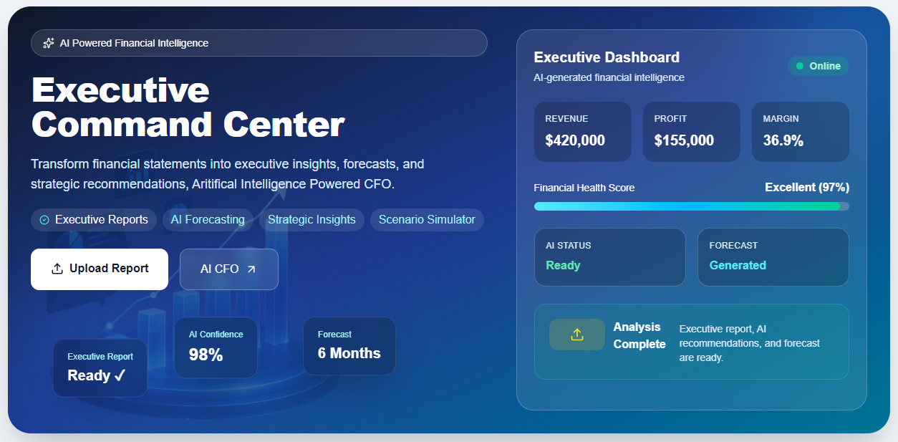
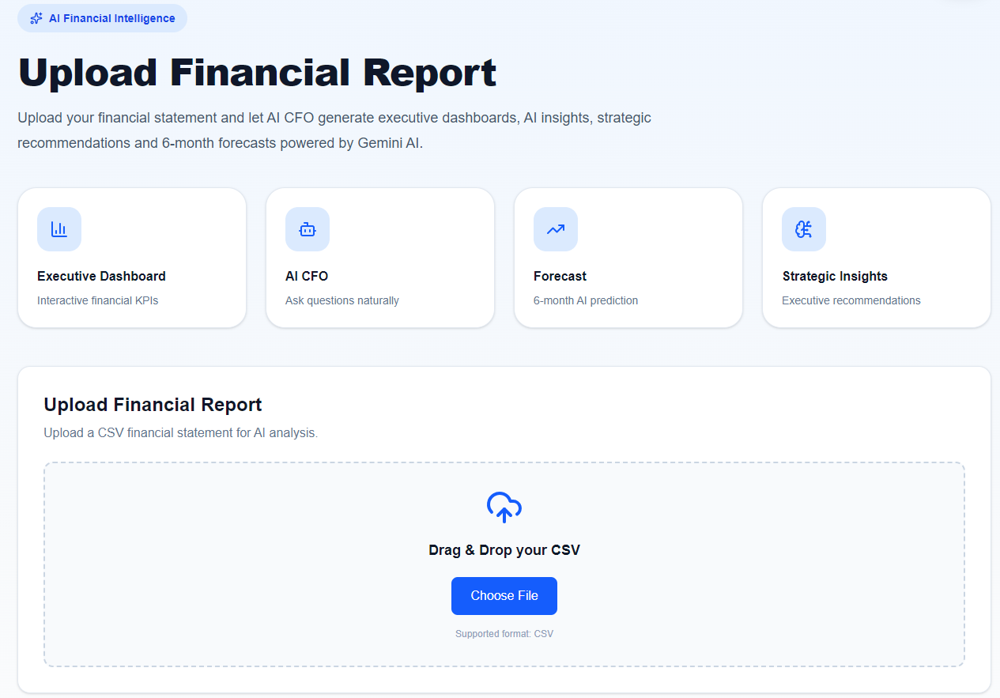
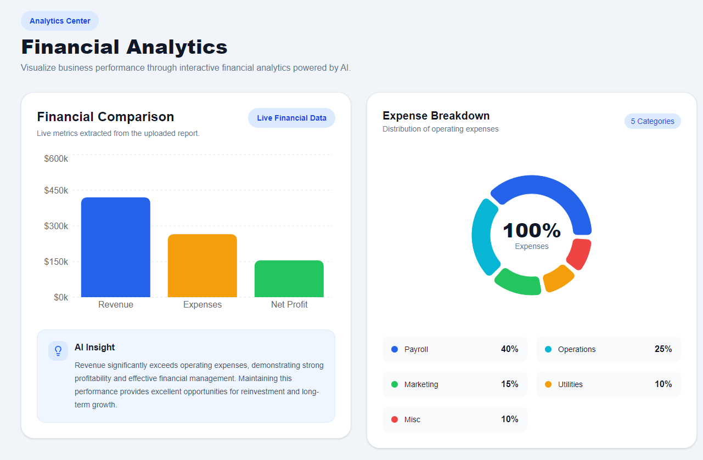
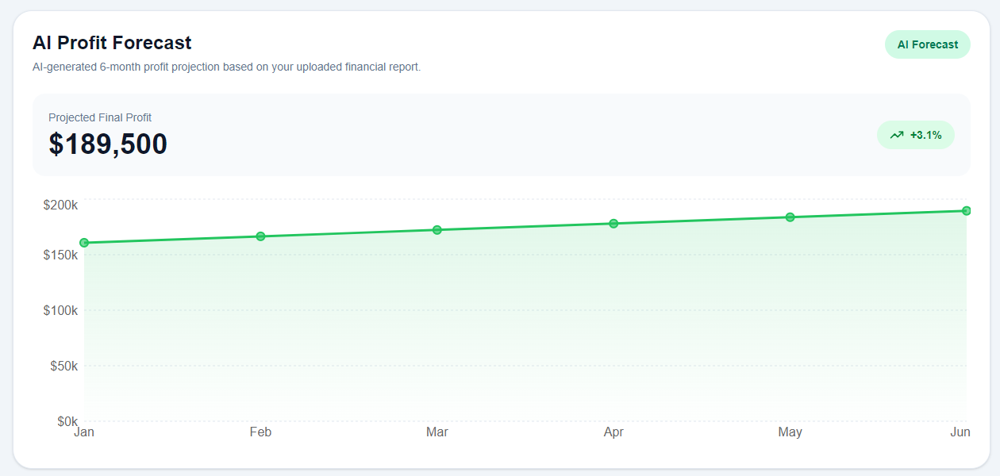
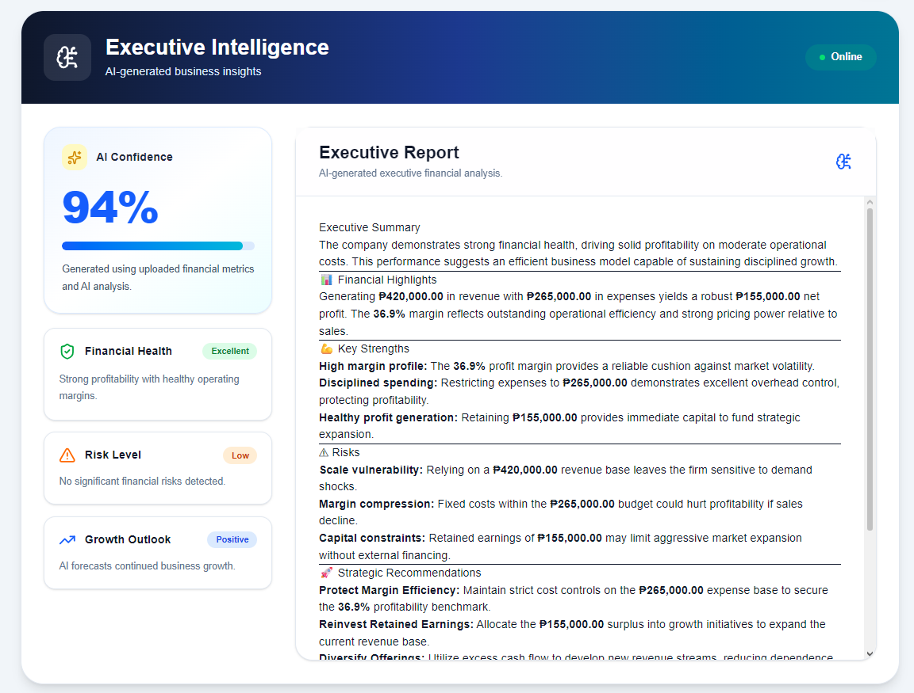
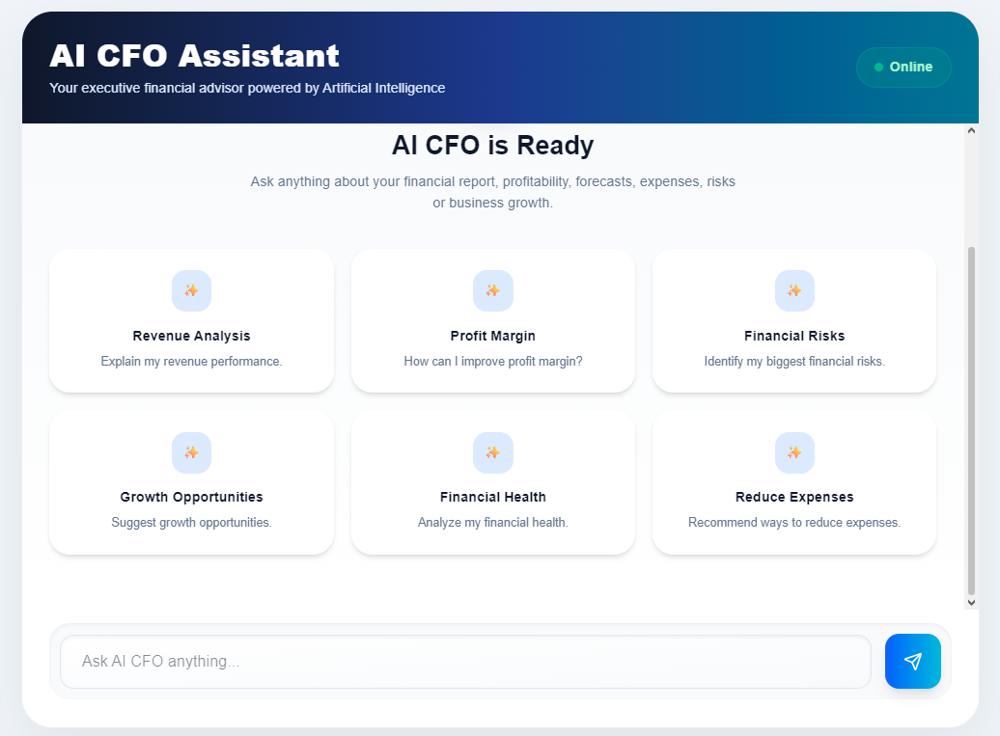

# Below is the other repository for this project:
https://github.com/Upstart-Union/ai-cfo-api


# AI CFO

AI CFO is an AI-powered financial intelligence platform that transforms uploaded financial statements into executive dashboards, forecasts, strategic insights, and conversational business recommendations.

Built for the AMD Developer Hackathon Act II.

---

## Features

- Financial statement CSV upload
- Executive Dashboard
- AI-generated Executive Summary
- AI Recommendations
- Financial Forecasting
- Interactive Analytics
- AI CFO Chat Assistant
- Persistent dashboard and chat history
- Modern responsive interface

---

## Tech Stack

### Frontend

- Next.js 16
- React
- TypeScript
- Tailwind CSS
- Framer Motion
- Recharts
- Zustand
- React Markdown

### Backend

- FastAPI
- Python
- Google Gemini API
- Pandas

---

## Project Structure

```
ai-cfo-web/
│
├── src/
│   ├── app/
│   ├── components/
│   ├── charts/
│   ├── stores/
│   ├── hooks/
│   ├── api/
│   └── types/
│
├── public/
└── README.md
```

---

## Screenshots









---

## Installation

```bash
npm install
npm run dev
```

Runs on:

```
http://localhost:3000
```

---

## AI Features

- Executive financial summaries
- Strategic recommendations
- Conversational financial assistant
- Profitability analysis
- Financial health evaluation
- Forecast generation

---

## Built For

AMD Developer Hackathon Act II

Track: Unicorn

Powered by AMD AI technologies and Google Gemini.
